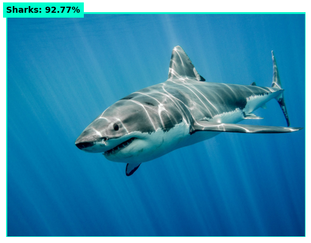
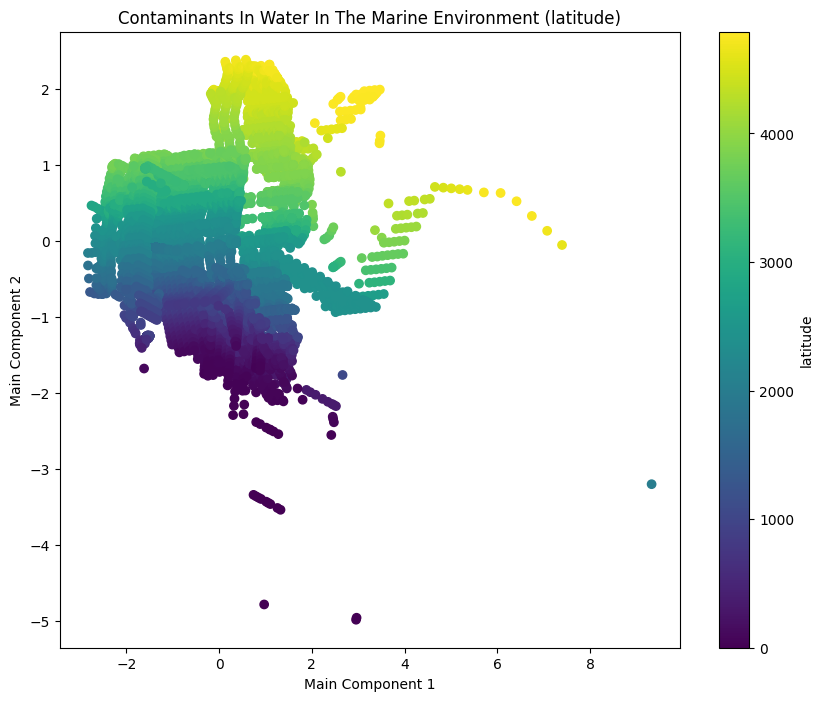
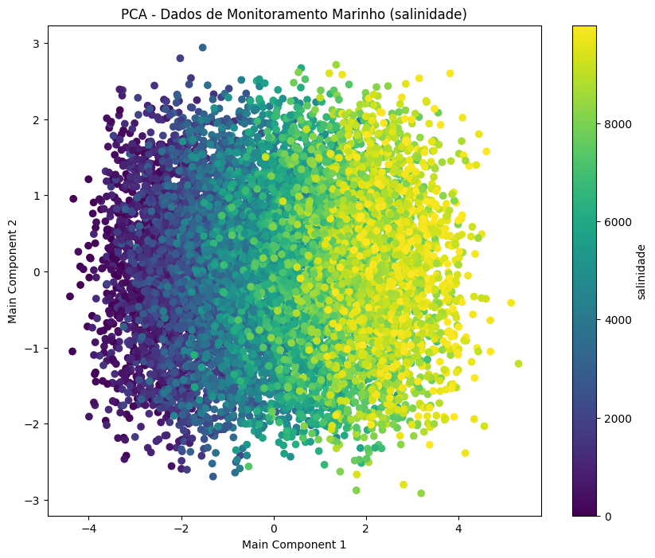
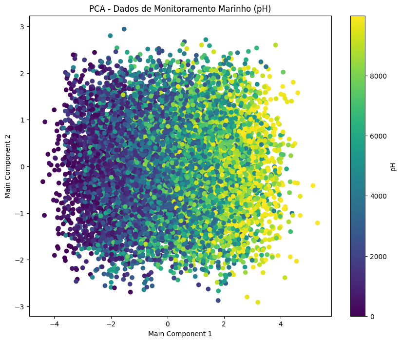
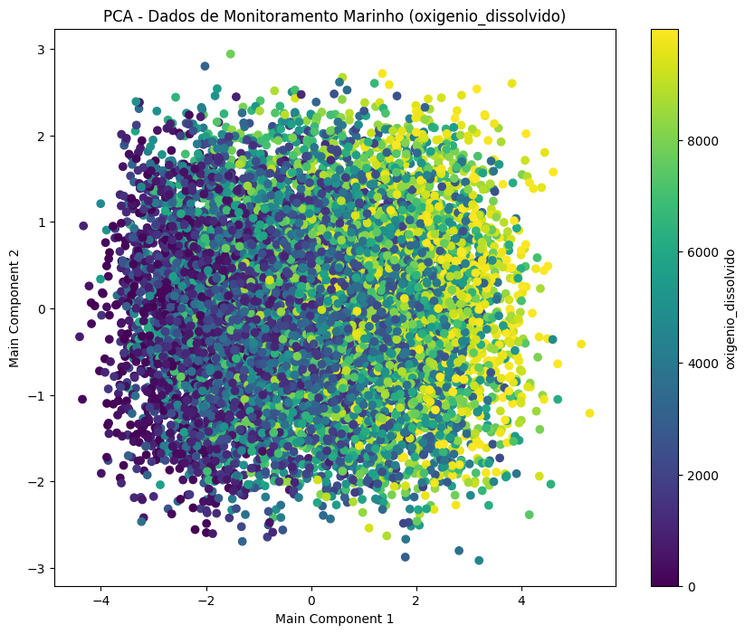

# Final Global Solution - MarinAI

## Nosso modelo

Apresentamos a você MarinAI, um conjunto de modelos que pode ser usado por empresas marinhas de todo o mundo para validação das condições ambientais relacionadas aos oceanos do mundo.

# Modelo primário - Roboflow

## Como funciona

Você provavelmente já viu algum modelo de IA treinada com o roboflow, isso porque ele oferece uma ampla variedade de datasets para treinamento e aprendizados de máquinas, com nós não foi diferente, utilizamos essa tecnologia ao nosso favor para desenvolvedor um modelo de classificação de espécies marinhas.

## Especificações

- **Dataset:** Roboflow
- - 8000 mil imagens
- - Uma espécie por vez
- - Classificação de mais de 25 espécies

<br/>

- **APIs:** Roboflow
- - URL https://classify.roboflow.com
- - Modelo finalglobalsolutionfiap/1
- - Tipo de classificação

<br/>

## Modos de uso

Fizemos a desenvoltura do app em .ipynb, isso facilita muito os testes em relação a ferramenta, portanto execute célula por célula para ver o o programa funcionando.

Você pode fazer o upload de sua própria imagem, nesse caso como exemplo, veja este animal.


<br/>

Em certas condições a depender da qualidade da água, não seria possível identifcar de qual espécie é este animal, porém fazendo o upload dela com nosso modelo você terá algo como

<br/>

<div style="display: flex; justify-content: center">
    
</div>

<br/>

Você pode estar pensando, eu definitivamente nãoo preciso disso, obviamente é um tubarão, porém, se conseguimos fazer isso com 8000 mil imagens, imagine o que poderiam ser feitos não somente coom isso mas com milhões ou até bilhões de referências, certamente poderíamos distinguir até de qual raça a espécie pertence.

# Modelo secundário - P1

## Como funciona

Neste moodelo simples decimos implementar algo comum que ajudaria-nos a entender melhor sobre o processo de contaminação das águas ao longo dos períodos, nessa parte utilizamos métodos Elbow para a escoolha de K e dividímos isso ao longo da aplicação para a classifição dos clusters.

## Especificações

- **Dataset:** Kagle
- - Conjunto de 10 mil dados
- - Dados sobre contaminantes no oceano
- - Contaminants In Water In The Marine Environment.csv

<br/>

<div style="display: flex; justify-content: center">
    
</div>

<br/>

# Modelo secundário - P2

## Como funciona

Neste caso opitamos por fazer algo diferente, como utilizamos datasets reais em ambos os casos até agora, não conseguimos identificar nenhuma condição extrema que fizesse com que nos desenvolvesse uma API de fato, portanto decidimos construir um dataset com modelos exemplares, porém, coom curvas de aprendizado ideênticas as usadas para modelos reais.

## Especificações

- **Dataset:** Criado na segunda célula
- - Conjunto de 10 mil dados (+ se opitar)
- - Dados sobre contaminantes da água em geral em relação a época
- - Dados Monitoramento De Poluentes Marinho.csv

<br/>

## Modos de uso

Fizemos a desenvoltura do app em .ipynb, isso facilita muito os testes em relação a ferramenta, portanto execute célula por célula para ver o o programa funcionando.

Como no P1 utilizamos métodos Elbow e moodelo para classifição para amostra dos clusters, porém, desta vez, vimos algo diferente

<div style="display: flex; justify-content: center">
  
</div>

<br/>

Sabemos que este não é o melhor gráfico para visualizar aumentos, porém, identificando grupos, podemos afirmar a coondição da água em níveis de salidade da região, oobserve outras análises, como ph e oxigênio dissolvido.

<br/>

<div style="display: flex; justify-content: center">
  
</div>

<br/>
<div style="display: flex; justify-content: center">
  
</div>

<br/>

# API

## Modelo Final

Depois de muito entender os gráficos, finalmente conseguimos chegar a um modelo interessante no qual nos desse 3 informações

- **MSE:** _(Mean Squared Error)_ ou _Erro Quadrático Médio_ calcula a média dos quadrados das diferenças entre os valores previstos pelo modelo e os valores reais.
- **Fórmula:**

$$ \text{MSE} = \frac{1}{n} \sum\_{i=1}^{n} (y_i - \hat{y}\_i)^2 $$

- **Score:** O _Score de validação cruzada médio_ refere-se à média dos escores obtidos em diferentes iterações de validação cruzada. Validação cruzada é uma técnica usada para avaliar a performance de um modelo de aprendizado de máquina.
- **Fórmula:**

$$
\overline{s} = \frac{1}{k} \sum_{i=1}^{k} s_i
$$

- **Nível:** O _nível_ refere-se aos valores previstos dos parâmetros de qualidade da água para o ano de 2050. Esses parâmetros são indicadores de poluentes marinhos e condições ambientais, e os valores previstos são obtidos usando modelos de regressão linear treinados com dados históricos.
- **Fórmula:**

$$
y = \beta_0 + \beta_1 x
$$

# Rotas disponíveis

## Na penultima e última células inicie o servidor flask

Lembre-se que o servidor flask só irá funcionar se antes você já tiver executado todas as demais células

Utilizando um administrados de requisições como Insominia você pode disparar para o endpoint

- **[GET]** http://127.0.0.1:5000/previsoes/<ANO_PREVISAO> #2025 exemplo.

```json
// Resposta do servidor flask

{
  "mse_scores": {
    "fosforo": 6.125663574931166e-6,
    "nitrogenio": 0.0003042876451874509,
    "oxigenio_dissolvido": 0.0014091803203688078,
    "pH": 0.00010672908885031738,
    "salinidade": 0.0013834906144131792,
    "temperatura": 0.0024899812259802138,
    "turbidez": 0.006062328645420454
  },
  "previsoes": {
    "fosforo": 0.19405787339385097,
    "nitrogenio": 1.6046933777371784,
    "oxigenio_dissolvido": 8.60216214850562,
    "pH": 8.911543763990291,
    "salinidade": 54.30875456256324,
    "temperatura": 40.17069653581622,
    "turbidez": 6.512671750231431
  },
  "scores": {
    "fosforo": 90.04605530244761,
    "nitrogenio": 95.86769049410026,
    "oxigenio_dissolvido": 95.16296021610268,
    "pH": 99.16236702221724,
    "salinidade": 99.92466158351962,
    "temperatura": 99.87692141216475,
    "turbidez": 91.20305733926743
  }
}
```

- **[POST]** http://127.0.0.1:5000/previsoes

```json
// Body da requisição é a respoosta da mesma quando [GET], ou seja

{
  "mse_scores": {
    "fosforo": 6.125663574931166e-6,
    "nitrogenio": 0.0003042876451874509,
    "oxigenio_dissolvido": 0.0014091803203688078,
    "pH": 0.00010672908885031738,
    "salinidade": 0.0013834906144131792,
    "temperatura": 0.0024899812259802138,
    "turbidez": 0.006062328645420454
  },
  "previsoes": {
    "fosforo": 0.19405787339385097,
    "nitrogenio": 1.6046933777371784,
    "oxigenio_dissolvido": 8.60216214850562,
    "pH": 8.911543763990291,
    "salinidade": 54.30875456256324,
    "temperatura": 40.17069653581622,
    "turbidez": 6.512671750231431
  },
  "scores": {
    "fosforo": 90.04605530244761,
    "nitrogenio": 95.86769049410026,
    "oxigenio_dissolvido": 95.16296021610268,
    "pH": 99.16236702221724,
    "salinidade": 99.92466158351962,
    "temperatura": 99.87692141216475,
    "turbidez": 91.20305733926743
  }
}
```

```json
// Resposta do servidor flask

{
  "fosforo": "O nível de fósforo da água não corresponde a um padrão adequado",
  "nitrogenio": "",
  "oxigenio_dissolvido": "O nível de Oxigênio dissolvido na água não corresponde a um padrão adequado",
  "ph": "",
  "qualidade": "imprópria",
  "salinidade": "",
  "temperatura": "",
  "turbidez": "O nível de turbidez da água não corresponde a um padrão adequado"
}
```

<br/>

# Considerações finais

## Fiap - Global Solution - MarinAI

## RMs

- ### Rodrigo Bianco de Carvalho **RM96978**
- ### Lucas do Santos Segantini **RM96792**
- ### Matheus do Santos **RM96727**
- ### Sean Sato **---**
- ### Rodrigo Favilla Zara **RM97172**
